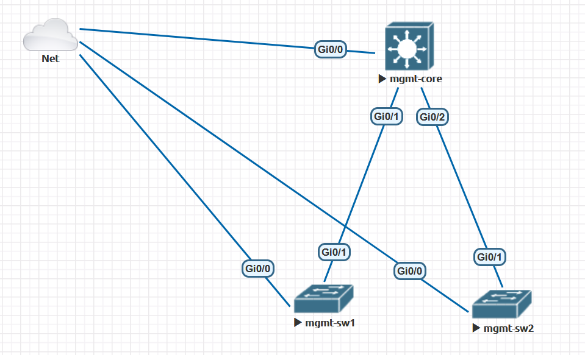

# Automated-Net

Ansible playbook and roles to automate a basic network

Uses Cisco.IOS collection which can be installed as below

```
ansible-galaxy collection install cisco.ios
```

# Network Topology


